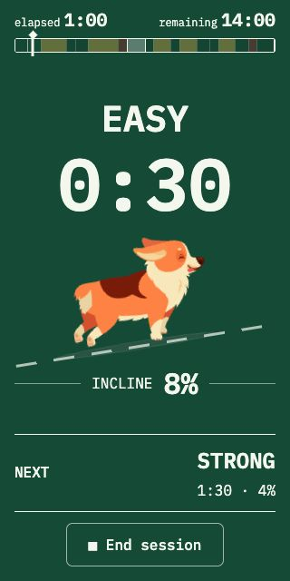
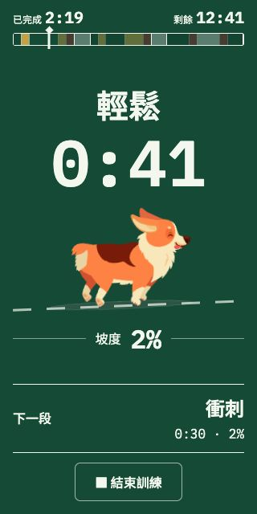

# Bilingual typography and responsive review

The existing mobile-ui-tune-up worktree uses IBM Plex Mono for English UI and numeric values in both languages, bundled Noto Sans TC for Traditional Chinese UI, and Barlow Condensed 800 only for the cabinet marquee. The original small wordmark keeps its family, weight and tracking. Shared body, control, metadata and heading roles replace inconsistent screen-specific fonts. Accepted ticket/result compositions and workout behavior are preserved.

## Responsive fixes

The running screen’s implicit minimum grid width expanded beyond the narrow viewport when header text became wider. Explicit shrinkable grid tracks, compact narrow-header roles, a responsive corgi frame with a proportional baseline, and shorter portrait spacing correct the source of the clipping. English and Chinese running main/document dimensions are 320×640 at a 320×640 viewport; the End button is fully visible. Cabinet drum lettering, lever caption, countdown wrapping, ticket headings and confirmation copy were also tuned around the selected fonts. Longer paper and result views retain natural vertical scrolling.

## Changed implementation files

- `src/styles.css`: shared typography roles, locale family selection, responsive running/cabinet/ticket/countdown/dialog layout.
- `src/main.tsx`: import only used font weights.
- `src/platform/share.ts`: apply the same UI/numeric/wordmark roles to Canvas and load only used faces.
- `e2e/share-fonts.spec.ts`: update the existing font-loading fixture to the current faces.

Other worktree changes predate this typography review and are preserved. This review occurred before PR submission; the current PR verification record supersedes its test-status snapshot. Design rules, plans and verification lessons are in docs.

## Verification

| Check | Result |
|---|---|
| Actual computer-use journey | Machine, ticket/footer, countdown, running, confirmation, result and language picker in both languages; desktop, narrow portrait and short landscape reviewed |
| Narrow running view | Complete header, cue, incline, next and End at 320×640 in both languages |
| Project tests | 45 tests across 12 files passed |
| Lint, typecheck/build, whitespace | Passed |
| E2E specification parsing | 48 specs listed; full suite not run |
| Font evidence | Authored Chinese glyph coverage, actual imported weights and equal numeric advances checked |
| Native Canvas exports | Nine cases: all three templates in both languages, 60-minute, early-ended and zero-duration; text bounds and recorded-duration sums passed |
| Font-stall fallback | Existing bounded deadline retained; verified fallback |

Assumption: the user’s preferred original English face applies to functional English typography; the physical cabinet marquee remains its display exception. Reviewed common layouts pass; physical devices, a treadmill session, full browser suite and browser download-event completion remain unverified. Native PNG generation and live result rendering were verified.

The existing user browser remains open on the English machine with the temporary viewport reset. The previously requested preview server remains at http://127.0.0.1:5173/ (PID 86929; cleanup: `kill 86929`). No additional persistent process was started.

## Visual evidence

[Desktop machine](machine-en-desktop.jpg), [narrow machine](machine-en-320.jpg), [English ticket](ticket-en-320.jpg), [Chinese ticket](ticket-zh-320.jpg), [countdown](countdown-en-320.jpg), [result](result-en-mobile.jpg), [Chinese landscape](running-zh-landscape.jpg).

The native Canvas verification ran the actual exporter using static instances of the bundled font assets; `profile-export-verification.json` records sample results and text bounds. Verification-only font copies and environment-specific rendering scripts remain in the local main-root evidence directory rather than adding duplicate fonts to the repository.

## PR verification update

This review predates the final Duration-row alignment change. Its screenshots verify the prior responsive work, not that final alignment. The create-pr gate runs the full browser suite and records current results in `docs/reviews/current-ui-pr-verification.md`.
